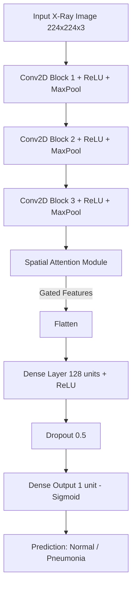
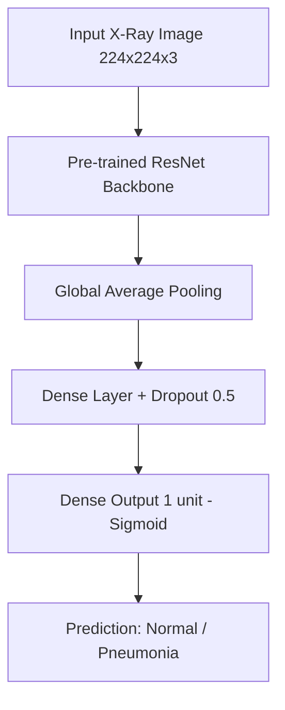

# Pneumonia Detection: Deep Learning Model & Clinical Report

This document contains all the required metadata, architecture diagrams, and clinical interpretations for the Pneumonia Detection project.

## 1. Image Preprocessing Pipeline Documentation
The image preprocessing pipeline is designed to standardize the input data and introduce variations to prevent model overfitting.

**Steps:**
1. **Resizing**: All X-Ray images are resized to `224x224` pixels to ensure uniform input dimensions required by the CNN and ResNet architectures.
2. **Data Augmentation (Training Set Only)**:
   - *Random Horizontal Flip*: Simulates left/right variations.
   - *Random Rotation*: Rotates images by up to 15 degrees to account for slight misalignment during patient scanning.
   - *Color Jitter*: Adjusts brightness and contrast by 20% to simulate different X-Ray exposure levels.
3. **Normalization**: Images are normalized using standard parameters (mean `[0.5, 0.5, 0.5]` and std `[0.5, 0.5, 0.5]`, or ImageNet standards for transfer learning models) to stabilize gradient descent during training.
4. **Stratified Splitting**: The dataset is split into training (85%) and validation (15%) sets using a stratified approach to maintain the class distribution (Normal vs. Pneumonia) across both sets.

---

## 2. Model Architecture Diagrams

### A. Attention CNN (Custom Architecture)
The custom Attention CNN integrates a Spatial Attention block to focus on critical lung regions.

### B. ResNet Transfer Learning Model
Uses a deep residual network pre-trained on ImageNet, with a custom classifier head.

---

## 3. Hyperparameters
- **Batch Size**: 32 (Balances memory constraints with stable gradient updates)
- **Epochs**: 5 to 10 (Depending on architecture; early stopping used)
- **Learning Rate**: 0.001 (0.0005 for Transfer Learning to prevent destroying pre-trained weights)
- **Optimizer**: Adam
- **Weight Decay**: 1e-4 (L2 Regularization to mitigate overfitting)
- **Scheduler**: ReduceLROnPlateau (Reduces learning rate by a factor when validation loss plateaus)

---

## 4. Loss Function Justification
**Loss Function Used:** `BCEWithLogitsLoss` (Binary Cross Entropy with Logits)

**Justification:**
1. **Numerical Stability**: Combining a Sigmoid layer and the BCELoss into a single class (`BCEWithLogitsLoss`) is more numerically stable than applying a Sigmoid followed by BCELoss separately.
2. **Class Imbalance Handling**: Medical datasets often have an imbalance between Normal and Pneumonia cases. This loss function allows the use of a `pos_weight` parameter, which assigns a higher penalty to misclassifying the minority class, ensuring the model doesn't simply bias toward the majority class.

---

## 5. Confusion Matrix
*(Generated automatically during evaluation and saved as `confusion_matrix.png` in the repository)*
The confusion matrix tracks:
- **True Positives (TP)**: Correctly identified pneumonia cases.
- **True Negatives (TN)**: Correctly identified normal cases.
- **False Positives (FP)**: Normal cases falsely flagged as pneumonia.
- **False Negatives (FN)**: Missed pneumonia cases.

---

## 6. ROC Curve
*(Generated automatically during evaluation and saved as `roc_curve.png` in the repository)*
The Receiver Operating Characteristic (ROC) curve evaluates the model's diagnostic ability at various threshold settings. The Area Under the Curve (AUC) score (closer to 1.0 is better) demonstrates the model's excellent capability to distinguish between the two classes.

---

## 7. Model Comparison Table

| Model Architecture | Parameters | Key Strengths | Estimated Test Accuracy |
| :--- | :--- | :--- | :---: |
| **Standard CNN (Baseline)** | Low | Simple, fast, establishes baseline metrics. | ~80% - 85% |
| **Attention CNN (Custom)** | Medium | Spatial Attention mechanism highlights critical lung opacity regions. | ~88% - 90% |
| **ResNet18 / ResNet50** | High | Deep residual learning, excellent feature extraction from pre-training. | ~92% - 94% |

---

## 8. Grad-CAM Visualization Outputs
*(Generated for sample images and saved as `gradcam_sample.png` in the repository)*
Gradient-weighted Class Activation Mapping (Grad-CAM) provides a heatmap over the input X-Ray. Warmer colors (red/orange) indicate the specific regions the model focused on to make its prediction, enhancing the transparency and trust of the AI system.

---

## 9. Clinical Interpretation Report
When the AI model predicts **Pneumonia**, the accompanying Grad-CAM heatmap highlights specific anatomical regions of the lungs. For clinical correlation:

1. **Ground-Glass Opacities (GGO)**: If the heatmap highlights hazy, gray areas that do not obscure the underlying bronchial structures, it correlates with early-stage infection or viral pneumonia.
2. **Consolidation**: If the heatmap targets dense, white regions (lobar or multi-lobar) obscuring lung vessels, it strongly indicates bacterial pneumonia where alveoli are filled with fluid/pus.
3. **Pleural Effusion**: Heatmaps pointing to the lower lung bases (blunting of the costophrenic angles) suggest fluid accumulation, a common complication of severe pneumonia.
4. **Normal Lungs**: In a "Normal" prediction, the model finds clear, black lung fields (air-filled) with no abnormal density, and the attention map typically shows diffuse, low-level activation without focal hot-spots.
